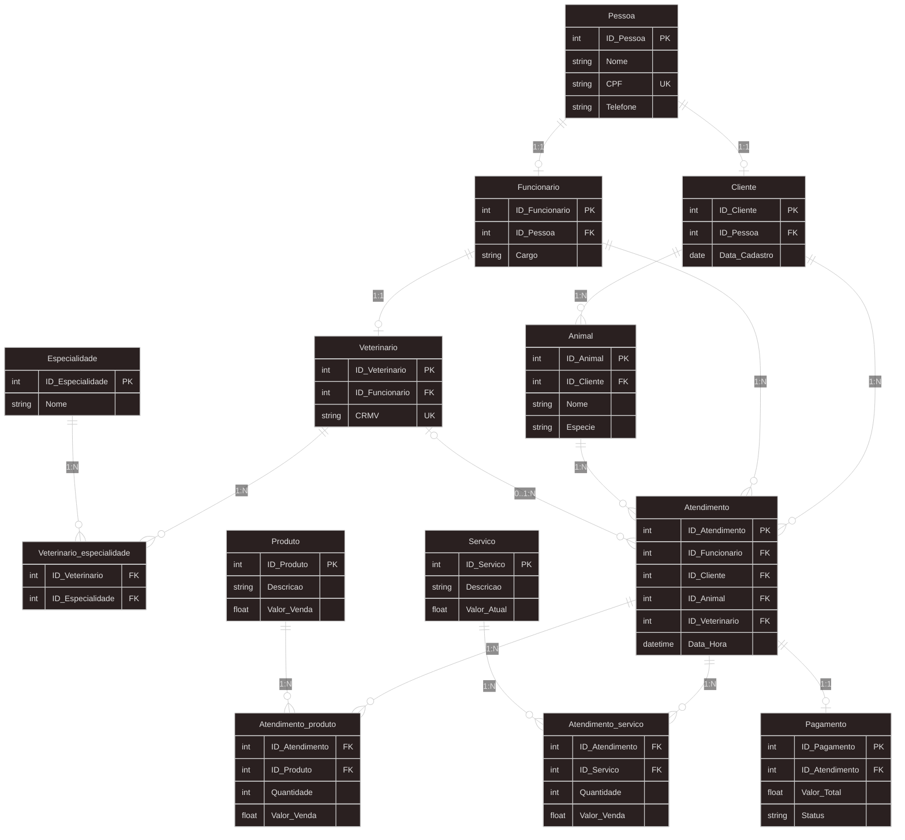

Sistema de Clínica Veterinária
Este projeto tem como objetivo desenvolver o modelo de dados para uma clínica veterinária de pequeno porte.

O sistema foi modelado para gerenciar:
- Cadastro de pessoas (clientes e funcionários)
- Cadastro de animais
- Registro de atendimentos
- Controle de produtos
- Controle de serviços
- Registro de pagamentos

Aqui estão definidos:
- Entidades do sistema
- Chaves primárias (PK)
- Chaves estrangeiras (FK)
- Relacionamentos (1:1, 1:N e N:N)
- Tabelas associativas
- Diagrama ER

